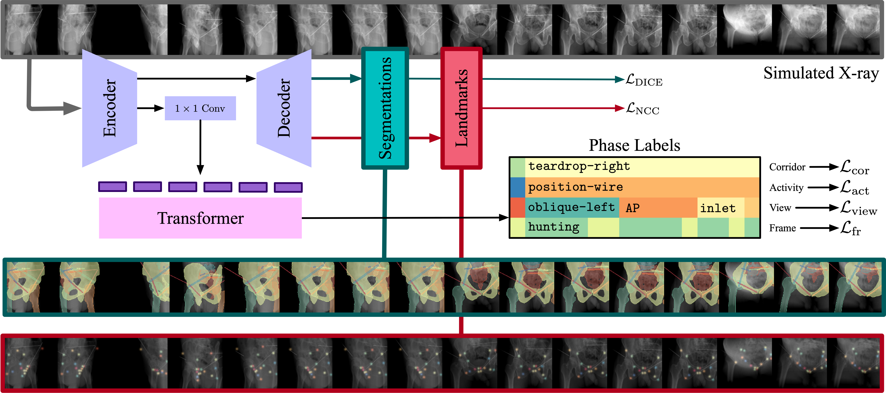

<div align="center">

# Pelphix

Surgical Phase Recognition from X-ray Images in Percutaneous Pelvic Fixation


</div>
<div align="left">

## Overview

Surgical phase recognition (SPR) is a crucial element in the digital transformation of the modern operating theater. While SPR based on video sources is well-established, incorporation of interventional X-ray sequences has not yet been explored. This paper presents Pelphix, a first approach to SPR for X-ray-guided percutaneous pelvic fracture fixation, which models the procedure at four levels of granularity – corridor, activ- ity, view, and frame value – simulating the pelvic fracture fixation work- flow as a Markov process to provide fully annotated training data. Using added supervision from detection of bony corridors, tools, and anatomy, we learn image representations that are fed into a transformer model to regress surgical phases at the four granularity levels. Our approach demonstrates the feasibility of X-ray-based SPR, achieving an average accuracy of 93.8% on simulated sequences and 67.57% in cadaver across all granularity levels, with up to 88% accuracy for the target corridor in real data. This work constitutes the first step toward SPR for the X-ray domain, establishing an approach to categorizing phases in X-ray-guided surgery, simulating realistic image sequences to enable machine learning model development, and demonstrating that this approach is feasible for the analysis of real procedures. As X-ray-based SPR continues to ma- ture, it will benefit procedures in orthopedic surgery, angiography, and interventional radiology by equipping intelligent surgical systems with situational awareness in the operating room.

If you find this work useful in your research, please consider citing:

```bibtex
TODO: add citation
```

## Installation

### Install from Source

```bash
git clone git@github.com:benjamindkilleen/pelphix.git
git submodule init
git submodule update
```

Then install the conda environment with

```bash
conda env create -f environment.yaml
```

### Pip Install

TODO: install from pip.

## Data

TODO: add data download instructions, first to the zip folders of the Pelphix datasets. Provide
instructions for obtaining the NMDID data, and maybe link to the nmdid-arcade repo.

## Usage

Activate the environment.

```bash
conda activate pelphix
```

Then run experiments with:

```bash
python main.py experiment={ssm,generate,pretrain,train,test} [options]
```

### Options

See [conf/config.yaml](/conf/config.yaml) for a full list of options. Common variations are:

- `gpus=n` to use `n` GPUs.

## Details



## TODO

<!-- TODO for MICCAI rebuttal -->
- [ ] Add view-invariant pretraining dataset.
  - [ ] Screws and wires in random positions/orientatins in the sphere.
  - [ ] Randomly sample views in 75 degrees around AP, 30 degrees around lateral.
  - [ ] Randomly sample positions in the sphere.
  - [ ] Anatomy segmentations, corridor segmentations, keypoints, wires, screws.
  - [ ] Classify views as being from a standard view (and which one) or not, based on a head coming off the U-Net bottom.
- [ ] Fix sequence generation to be more realistic.
  - [ ] Remove `Step` from the Workflow State.
  - [ ] Randomly sample task order. Allow screw insertion to be sampled at any time.
  - [ ] Limit views for each task to ones actually used.
  - [ ] Add missing views.
  - [ ] Make sampling more realistic for views/positions.
  - [ ] Corridor segmentation should never vary, only the distance along it that wires/screws are inserted.
  - [ ] Wire should always go the full length of the corridor (whatever that is for the given corridor).
  - [ ] "Correct" view might be randomly sampled, but tolerance should be smaller?
- [ ] Update the model to something more advanced, maybe TransUNet
  - [ ] Eventually use SwinTransformer
  - [ ] Pre-training step, with `(black, black, frame)` as input.
  - [ ] 3-frame input should be `(prev-prev, prev, current)`, with black for `prev-prev` if it doesn't exist.

</div>
